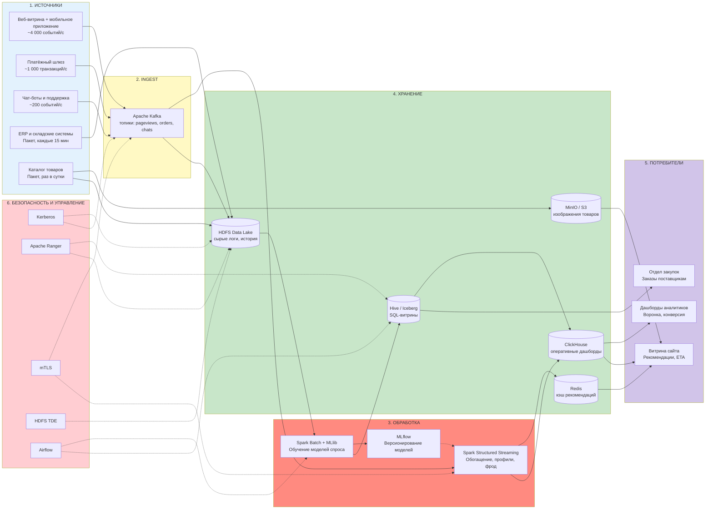

## «Проектирование архитектуры BigData-системы»
### Вариант 1. Крупный онлайн-ритейлер

---

## Постановка задачи

Онлайн-ритейлер с многомиллионной аудиторией. Данные — основной актив: от скорости анализа поведения пользователей зависит конверсия, от точности прогноза спроса — издержки на складскую логистику. Бизнес-задачи:

1.  **Анализ поведения пользователей в реальном времени.** Пока пользователь на сайте, система должна успеть обновить рекомендации и выявить подозрительную активность (фрод) до завершения заказа.
2.  **Прогнозирование спроса.** На основе всей истории продаж строить ML-модели, предсказывающие спрос на каждый товар в разрезе склада и дня — чтобы автоматически формировать заказы поставщикам.
3.  **Регуляторные требования.** 152-ФЗ по персональным данным покупателей, PCI DSS по приёму карт, доступность 99.99% (бизнес теряет деньги за каждую минуту простоя).

## Пошаговый алгоритм выполнения

### Шаг 1. Анализ требований

| Параметр | Значение | Архитектурное следствие |
|---|---|---|
| **Объём данных** | **500 ТБ/год**, рост **50%** ежегодно | HDFS на собственном оборудовании в РФ. Через 5 лет потребуется более 11 ПБ дисков. Облака невыгодны. |
| **Скорость поступления** | **до 5 000 событий/с** | Kafka с репликацией 3 и партиционированием. Пики (Чёрная пятница) не должны ронять систему. |
| **Типы данных** | 60% структурированные, 30% полуструктурированные, 10% неструктурированные | Полиглот-хранилище: HDFS для логов, ClickHouse для аналитики, MinIO для картинок товаров. |
| **Требования к обработке** | Анализ поведения в реальном времени, прогнозирование спроса | Два контура: real-time (потоковая обработка) и batch (обучение моделей на истории). |
| **Доступность** | **99.99%** (простой ≤ 52 минут/год) | Гео-резервирование между двумя ЦОДами в РФ, горячее резервирование критичных сервисов. |
| **Время отклика** | **< 5 секунд** | Redis для кэша рекомендаций, ClickHouse для аналитических запросов. Потоковая обработка должна укладываться в 1-2 секунды. |
| **Безопасность** | Шифрование, соответствие 152-ФЗ и PCI DSS | Токенизация карт на входе, маскирование ПДн, шифрование на дисках и в каналах. |

**Расчёт нагрузки:**

```
Поток:
5 000 событий/с × 3 КБ = 15 МБ/с
= 1,3 ТБ/сутки = ~474 ТБ/год

Каталог товаров с изображениями = ~30 ТБ/год
ИТОГО: ~504 ТБ/год — сходится с условием

Репликация HDFS (фактор 3): 500 × 3 = 1,5 ПБ дисков в первый год
Через 5 лет (рост 50% в год): 500 × 1.5^5 ≈ 3 800 ТБ/год → 11,4 ПБ дисков
```


### Шаг 2. Источники данных


### Шаг 2. Определение источников данных

| Источник данных | Тип загрузки | Интенсивность | Формат данных | Тип данных |
|---|---|---|---|---|
| **Веб-витрина и мобильное приложение** (клики, просмотры, добавления в корзину) | Потоковая | ~4 000 событий/с | JSON / Avro | **Полуструктурированные** |
| **Платёжный шлюз** (оформление заказов, оплата) | Потоковая | ~1 000 транзакций/с | JSON | **Структурированные** |
| **Чат-боты и служба поддержки** (тикеты, диалоги) | Потоковая | ~200 событий/с | Текст / JSON | **Неструктурированные** |
| **ERP и WMS — складские системы** (остатки, поставки, заказы поставщикам) | Пакетная, каждые 15 минут | — | CSV / Avro | **Структурированные** |
| **Система управления каталогом — PIM** (описания товаров, характеристики, фото) | Пакетная, раз в сутки | — | JSON / JPEG / PNG | **Структурированные + Неструктурированные** |

### Шаг 3. Выбор компонентов архитектуры

#### 3.1. Распределённое хранилище — HDFS (основное) + MinIO/S3 (объектное)

**Почему HDFS:**
- Это распределённая файловая система, способная хранить петабайты данных на сотнях серверов. Данные разбиваются на блоки фиксированного размера и хранятся с тройной копией на разных узлах. Выход из строя одного сервера не приводит к потере данных — система автоматически перераспределяет блоки на исправные узлы.
- Кластер разворачивается на собственном оборудовании в дата-центре на территории РФ, что закрывает требование 152-ФЗ о локализации персональных данных покупателей без привлечения иностранных облачных провайдеров. Компания полностью контролирует оборудование и место хранения данных.
- Высокая скорость чтения для Spark-задач достигается за счёт data locality: планировщик YARN назначает вычислительные задачи на те узлы, где уже лежат блоки данных. Это исключает передачу больших объёмов по сети и критически важно при обучении ML-моделей на двухлетней истории продаж.
- При объёме 500 ТБ/год и росте 50% собственное железо даёт стоимость владения в 3-5 раз ниже облачного S3 на горизонте 5 лет.

**Почему дополнительно MinIO:**
- 10% неструктурированных данных в 500 ТБ — это десятки миллионов изображений товаров в высоком разрешении (JPEG, PNG). Каждое изображение размером 1-5 МБ является «мелким файлом» для HDFS. NameNode хранит метаданные всех файлов в оперативной памяти — миллионы мелких файлов вызывают перерасход памяти и деградацию производительности. Объектное хранилище MinIO решает эту проблему, эффективно работая с миллиардами объектов.
- Изображения товаров должны мгновенно отдаваться на витрину интернет-магазина. MinIO, будучи S3-совместимым, легко интегрируется с CDN: витрина генерирует прямую ссылку на объект, и контент доставляется пользователю с ближайшего узла CDN.
- MinIO поддерживает тиринг данных: «горячие» изображения популярных товаров хранятся на быстрых SSD, архивные фото — на дешёвых HDD. Это снижает стоимость хранения без потери производительности.

---

#### 3.2. Шина данных — Apache Kafka

- **Kafka** — это распределённый журнал сообщений. Он принимает поток до 5 000 событий/с напрямую от веб-витрины, платёжного шлюза и чат-ботов, сохраняет их на диск в виде упорядоченной очереди и раздаёт потребителям. Сообщения не удаляются сразу, а хранятся заданное время (retention — 7 дней), что даёт возможность перечитать историю событий при сбое batch-обработки или для расследования инцидентов.
- Отказоустойчивость достигается хранением трёх копий каждого сообщения на разных брокерах. Настройка `min.insync.replicas = 2` и `acks = all` гарантирует, что сообщение считается записанным только после подтверждения минимум двух реплик. Потеря данных исключена.
- Партиционирование топиков (`pageviews`, `orders`, `chat_messages`) позволяет наращивать пропускную способность простым добавлением брокеров. В пиковые моменты (Чёрная пятница) система справляется с нагрузкой без деградации.

---

#### 3.3. Потоковая обработка — Spark Structured Streaming

- **Spark Structured Streaming** выполняет анализ поведения пользователей в реальном времени. Он читает сырой поток из Kafka и обрабатывает его микро-батчами с интервалом 1-2 секунды. Этой задержки достаточно, чтобы обновить профиль пользователя и рекомендации на витрине — требование SLA «< 5 секунд» выполняется с тройным запасом.
- В отличие от систем событийно-ориентированной обработки вроде Flink, микро-батчевая природа Spark не является проблемой для данного SLA. При этом команда Data Engineering уже обладает глубокой экспертизой в PySpark. Использование единого фреймворка для потоковой и пакетной обработки радикально снижает стоимость разработки и поддержки.
- Встроенные механизмы восстановления после сбоев: Spark Structured Streaming сохраняет позицию чтения из Kafka и промежуточное состояние в контрольных точках на HDFS. При падении и перезапуске обработка продолжается ровно с того места, где остановилась, без потери и дублирования событий.

---

#### 3.4. Пакетная обработка и машинное обучение — Apache Spark + MLflow

- **Spark** решает задачи, не требующие мгновенного ответа: обучение моделей прогнозирования спроса на двухлетней истории продаж, построение витрин для финансовой отчётности, ETL-процессы по очистке и нормализации данных из ERP-систем.
- **Spark MLlib** предоставляет готовые распределённые реализации алгоритмов (градиентный бустинг, случайный лес, ALS для рекомендаций). Модель обучается на полном объёме данных в HDFS, без необходимости делать выборки. Это повышает точность прогноза спроса на уровне SKU/склад/день.
- **MLflow** отслеживает версии обученных моделей и результаты экспериментов (гиперпараметры, метрики MAPE/WAPE). Лучшая модель регистрируется в Model Registry и автоматически подхватывается Spark Structured Streaming для применения на потоке. При деградации качества возможен мгновенный откат к предыдущей версии.

---

#### 3.5. Витрины данных — Hive/Iceberg + ClickHouse

- **Hive / Iceberg** — это слой, позволяющий аналитикам и специалистам по данным писать запросы на языке SQL к информации, лежащей в HDFS. Данные хранятся в открытых форматах (Parquet), но выглядят как обычные таблицы. Iceberg добавляет возможность фиксировать состояние таблиц на определённый момент времени (Snapshot Isolation). Это важно при подготовке финансовой отчётности: отчёт формируется по срезу данных на начало дня, даже если в HDFS продолжают поступать новые транзакции.
- **ClickHouse** — аналитическая база данных, оптимизированная под скорость ответа. Используется для построения оперативных дашбордов: воронка продаж в реальном времени, топ-товаров по просмотрам, конверсия в разрезе источников трафика. Колоночная архитектура и векторные вычисления обеспечивают субсекундные ответы на запросы к миллиардам строк. Это критически важно для итеративной работы аналитиков, где каждый запрос должен выполняться мгновенно.

---

#### 3.6. Кэш в оперативной памяти — Redis

- **Redis** хранит в оперативной памяти данные, к которым витрина обращается при каждом запросе пользователя: предсчитанные персональные рекомендации, текущие остатки популярных товаров на складах, ETA доставки для отслеживания заказов. Запрос к Redis занимает менее 1 миллисекунды.
- В масштабе сквозного бюджета времени на формирование страницы (< 5 секунд) Redis потребляет единицы миллисекунд, оставляя основной запас на бизнес-логику и рендеринг. Без in-memory кэша каждое обращение к дисковой СУБД добавляло бы десятки миллисекунд, что быстро исчерпало бы бюджет.

---

#### 3.7. Оркестрация — Apache Airflow

- **Airflow** управляет расписанием выполнения всех фоновых задач: ночная выгрузка данных из ERP и WMS в HDFS, переобучение моделей прогнозирования спроса в Spark, пересчёт витрин в Hive, загрузка обновлённого каталога товаров в MinIO. Каждая задача оформляется как звено в направленном ациклическом графе (DAG), где запуск следующего звена происходит только после успешного завершения предыдущего.
- Визуальный интерфейс Airflow позволяет видеть статус выполнения всех процессов в реальном времени и оперативно реагировать на сбои. Встроенные механизмы повторных попыток и уведомлений (email, Slack) минимизируют время восстановления.

---

#### 3.8. Безопасность (под 152-ФЗ и PCI DSS)

| Компонент | Что делает |
|---|---|
| **Kerberos** | Проверяет подлинность каждого сервиса и пользователя при подключении к кластеру. Без успешной проверки доступ к данным невозможен. Исключает подключение подставного узла или неавторизованного пользователя |
| **Apache Ranger** | Определяет, кому и к каким данным разрешён доступ. На колонки таблиц можно навесить метки, например «номер карты» или «ФИО покупателя», и настроить правило: аналитик видит только маску `****`, а не реальные данные |
| **Шифрование каналов (TLS/mTLS)** | Все данные между серверами передаются в зашифрованном виде. Дополнительно каждый сервер предъявляет цифровой сертификат, подтверждающий, что это действительно он, а не подставной узел. Требование PCI DSS по защите каналов связи |
| **Шифрование дисков (HDFS TDE)** | Данные на жёстких дисках хранятся в зашифрованном виде. Ключ расшифровки хранится отдельно на сервере KMS. Украв физический диск, злоумышленник получит только нечитаемый набор символов |
| **Токенизация на платёжном шлюзе** | Реальный номер банковской карты заменяется на обезличенный токен на стороне платёжного шлюза, до отправки в Kafka. Таким образом, в Data Lake и аналитические системы платёжные данные не попадают, что радикально сужает периметр действия PCI DSS |
| **Аудит доступа** | Каждый факт обращения к конфиденциальным данным записывается в журнал (Ranger). Это требование закона: в случае инцидента можно установить, кто и когда смотрел информацию |
| **Размещение в РФ** | Все серверы основного и резервного центров обработки находятся на территории России. Персональные данные не покидают пределов РФ — требование 152-ФЗ выполнено |

---

## Схема архитектуры


