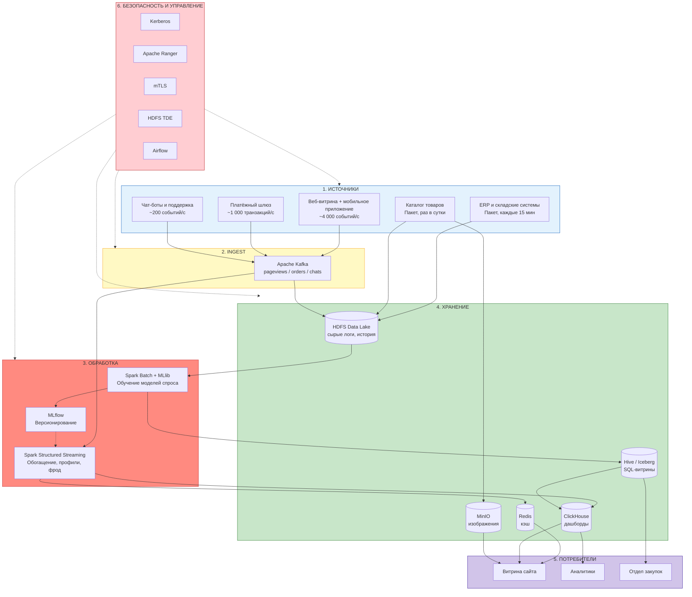

## «Проектирование архитектуры BigData-системы»
### Вариант 1. Крупный онлайн-ритейлер

---

## Постановка задачи

Онлайн-ритейлер с многомиллионной аудиторией. Данные — основной актив: от скорости анализа поведения пользователей зависит конверсия, от точности прогноза спроса — издержки на складскую логистику. Бизнес-задачи:

1.  **Анализ поведения пользователей в реальном времени.** Пока пользователь на сайте, система должна успеть обновить рекомендации и выявить подозрительную активность (фрод) до завершения заказа.
2.  **Прогнозирование спроса.** На основе всей истории продаж строить ML-модели, предсказывающие спрос на каждый товар в разрезе склада и дня — чтобы автоматически формировать заказы поставщикам.
3.  **Регуляторные требования.** 152-ФЗ по персональным данным покупателей, PCI DSS по приёму карт, доступность 99.99% (бизнес теряет деньги за каждую минуту простоя).

## Пошаговый алгоритм выполнения

### Шаг 1. Анализ требований

| Параметр | Значение | Архитектурное следствие |
|---|---|---|
| **Объём данных** | **500 ТБ/год**, рост **50%** ежегодно | HDFS на собственном оборудовании в РФ. Через 5 лет потребуется более 11 ПБ дисков. Облака невыгодны. |
| **Скорость поступления** | **до 5 000 событий/с** | Kafka с репликацией 3 и партиционированием. Пики (Чёрная пятница) не должны ронять систему. |
| **Типы данных** | 60% структурированные, 30% полуструктурированные, 10% неструктурированные | Полиглот-хранилище: HDFS для логов, ClickHouse для аналитики, MinIO для картинок товаров. |
| **Требования к обработке** | Анализ поведения в реальном времени, прогнозирование спроса | Два контура: real-time (потоковая обработка) и batch (обучение моделей на истории). |
| **Доступность** | **99.99%** (простой ≤ 52 минут/год) | Гео-резервирование между двумя ЦОДами в РФ, горячее резервирование критичных сервисов. |
| **Время отклика** | **< 5 секунд** | Redis для кэша рекомендаций, ClickHouse для аналитических запросов. Потоковая обработка должна укладываться в 1-2 секунды. |
| **Безопасность** | Шифрование, соответствие 152-ФЗ и PCI DSS | Токенизация карт на входе, маскирование ПДн, шифрование на дисках и в каналах. |

**Расчёт нагрузки:**

```
Поток:
5 000 событий/с × 3 КБ = 15 МБ/с
= 1,3 ТБ/сутки = ~474 ТБ/год

Каталог товаров с изображениями = ~30 ТБ/год
ИТОГО: ~504 ТБ/год — сходится с условием

Репликация HDFS (фактор 3): 500 × 3 = 1,5 ПБ дисков в первый год
Через 5 лет (рост 50% в год): 500 × 1.5^5 ≈ 3 800 ТБ/год → 11,4 ПБ дисков
```


### Шаг 2. Источники данных

| Источник данных | Тип загрузки | Интенсивность | Формат данных | Тип данных |
|---|---|---|---|---|
| **Веб-витрина и мобильное приложение** (клики, просмотры, добавления в корзину) | Потоковая | ~4 000 событий/с | JSON / Avro | **Полуструктурированные** |
| **Платёжный шлюз** (оформление заказов, оплата) | Потоковая | ~1 000 транзакций/с | JSON | **Структурированные** |
| **Чат-боты и служба поддержки** (тикеты, диалоги) | Потоковая | ~200 событий/с | Текст / JSON | **Неструктурированные** |
| **ERP и WMS — складские системы** (остатки, поставки, заказы поставщикам) | Пакетная, каждые 15 минут | — | CSV / Avro | **Структурированные** |
| **Система управления каталогом — PIM** (описания товаров, характеристики, фото) | Пакетная, раз в сутки | — | JSON / JPEG / PNG | **Структурированные + Неструктурированные** |

### Шаг 3. Выбор компонентов архитектуры

#### 3.1. Распределённое хранилище — HDFS (основное) + MinIO/S3 (объектное)

**Почему HDFS:**
- Это распределённая файловая система, способная хранить петабайты данных на сотнях серверов. Данные разбиваются на блоки фиксированного размера и хранятся с тройной копией на разных узлах. Выход из строя одного сервера не приводит к потере данных — система автоматически перераспределяет блоки на исправные узлы.
- Кластер разворачивается на собственном оборудовании в дата-центре на территории РФ, что закрывает требование 152-ФЗ о локализации персональных данных покупателей без привлечения иностранных облачных провайдеров. Компания полностью контролирует оборудование и место хранения данных.
- Высокая скорость чтения для Spark-задач достигается за счёт data locality: планировщик YARN назначает вычислительные задачи на те узлы, где уже лежат блоки данных. Это исключает передачу больших объёмов по сети и критически важно при обучении ML-моделей на двухлетней истории продаж.

**Почему дополнительно MinIO:**
- 10% неструктурированных данных в 500 ТБ — это десятки миллионов изображений товаров в высоком разрешении (JPEG, PNG). Каждое изображение размером 1-5 МБ является «мелким файлом» для HDFS. NameNode хранит метаданные всех файлов в оперативной памяти — миллионы мелких файлов вызывают перерасход памяти и деградацию производительности. Объектное хранилище MinIO решает эту проблему, эффективно работая с миллиардами объектов.
- Изображения товаров должны мгновенно отдаваться на витрину интернет-магазина. MinIO, будучи S3-совместимым, легко интегрируется с CDN: витрина генерирует прямую ссылку на объект, и контент доставляется пользователю с ближайшего узла CDN.

---

#### 3.2. Шина данных — Apache Kafka

- **Kafka** — это распределённый журнал сообщений. Он принимает поток до 5 000 событий/с напрямую от веб-витрины, платёжного шлюза и чат-ботов, сохраняет их на диск в виде упорядоченной очереди и раздаёт потребителям. Сообщения не удаляются сразу, а хранятся заданное время (retention — 7 дней), что даёт возможность перечитать историю событий при сбое batch-обработки или для расследования инцидентов.
- Отказоустойчивость достигается хранением трёх копий каждого сообщения на разных брокерах. Настройка `min.insync.replicas = 2` и `acks = all` гарантирует, что сообщение считается записанным только после подтверждения минимум двух реплик. Потеря данных исключена.
- Партиционирование топиков (`pageviews`, `orders`, `chat_messages`) позволяет наращивать пропускную способность простым добавлением брокеров. В пиковые моменты (Чёрная пятница) система справляется с нагрузкой без деградации.

---

#### 3.3. Потоковая обработка — Spark Structured Streaming

- **Spark Structured Streaming** выполняет анализ поведения пользователей в реальном времени. Он читает сырой поток из Kafka и обрабатывает его микро-батчами с интервалом 1-2 секунды. Этой задержки достаточно, чтобы обновить профиль пользователя и рекомендации на витрине — требование SLA «< 5 секунд» выполняется с тройным запасом.
- В отличие от систем событийно-ориентированной обработки вроде Flink, микро-батчевая природа Spark не является проблемой для данного SLA. При этом команда Data Engineering уже обладает глубокой экспертизой в PySpark. Использование единого фреймворка для потоковой и пакетной обработки радикально снижает стоимость разработки и поддержки.
- Встроенные механизмы восстановления после сбоев: Spark Structured Streaming сохраняет позицию чтения из Kafka и промежуточное состояние в контрольных точках на HDFS. При падении и перезапуске обработка продолжается ровно с того места, где остановилась, без потери и дублирования событий.

---

#### 3.4. Пакетная обработка и машинное обучение — Apache Spark + MLflow

- **Spark** решает задачи, не требующие мгновенного ответа: обучение моделей прогнозирования спроса на двухлетней истории продаж, построение витрин для финансовой отчётности, ETL-процессы по очистке и нормализации данных из ERP-систем.
- **Spark MLlib** предоставляет готовые распределённые реализации алгоритмов (градиентный бустинг, случайный лес, ALS для рекомендаций). Модель обучается на полном объёме данных в HDFS, без необходимости делать выборки. Это повышает точность прогноза спроса на уровне SKU/склад/день.
- **MLflow** отслеживает версии обученных моделей и результаты экспериментов (гиперпараметры, метрики MAPE/WAPE). Лучшая модель регистрируется в Model Registry и автоматически подхватывается Spark Structured Streaming для применения на потоке. При деградации качества возможен мгновенный откат к предыдущей версии.

---

#### 3.5. Витрины данных — Hive/Iceberg + ClickHouse

- **Hive / Iceberg** — это слой, позволяющий аналитикам и специалистам по данным писать запросы на языке SQL к информации, лежащей в HDFS. Данные хранятся в открытых форматах (Parquet), но выглядят как обычные таблицы. Iceberg добавляет возможность фиксировать состояние таблиц на определённый момент времени (Snapshot Isolation). Это важно при подготовке финансовой отчётности: отчёт формируется по срезу данных на начало дня, даже если в HDFS продолжают поступать новые транзакции.
- **ClickHouse** — аналитическая база данных, оптимизированная под скорость ответа. Используется для построения оперативных дашбордов: воронка продаж в реальном времени, топ-товаров по просмотрам, конверсия в разрезе источников трафика. Колоночная архитектура и векторные вычисления обеспечивают субсекундные ответы на запросы к миллиардам строк. Это критически важно для итеративной работы аналитиков, где каждый запрос должен выполняться мгновенно.

---

#### 3.6. Кэш в оперативной памяти — Redis

- **Redis** хранит в оперативной памяти данные, к которым витрина обращается при каждом запросе пользователя: предсчитанные персональные рекомендации, текущие остатки популярных товаров на складах, ETA доставки для отслеживания заказов. Запрос к Redis занимает менее 1 миллисекунды.
- В масштабе сквозного бюджета времени на формирование страницы (< 5 секунд) Redis потребляет единицы миллисекунд, оставляя основной запас на бизнес-логику и рендеринг. Без in-memory кэша каждое обращение к дисковой СУБД добавляло бы десятки миллисекунд, что быстро исчерпало бы бюджет.

---

#### 3.7. Оркестрация — Apache Airflow

- **Airflow** управляет расписанием выполнения всех фоновых задач: ночная выгрузка данных из ERP и WMS в HDFS, переобучение моделей прогнозирования спроса в Spark, пересчёт витрин в Hive, загрузка обновлённого каталога товаров в MinIO. Каждая задача оформляется как звено в направленном ациклическом графе (DAG), где запуск следующего звена происходит только после успешного завершения предыдущего.
- Визуальный интерфейс Airflow позволяет видеть статус выполнения всех процессов в реальном времени и оперативно реагировать на сбои. Встроенные механизмы повторных попыток и уведомлений (email, Slack) минимизируют время восстановления.

---

#### 3.8. Безопасность (под 152-ФЗ и PCI DSS)

| Компонент | Что делает |
|---|---|
| **Kerberos** | Проверяет подлинность каждого сервиса и пользователя при подключении к кластеру. Без успешной проверки доступ к данным невозможен. Исключает подключение подставного узла или неавторизованного пользователя |
| **Apache Ranger** | Определяет, кому и к каким данным разрешён доступ. На колонки таблиц можно навесить метки, например «номер карты» или «ФИО покупателя», и настроить правило: аналитик видит только маску `****`, а не реальные данные |
| **Шифрование каналов (TLS/mTLS)** | Все данные между серверами передаются в зашифрованном виде. Дополнительно каждый сервер предъявляет цифровой сертификат, подтверждающий, что это действительно он, а не подставной узел. Требование PCI DSS по защите каналов связи |
| **Шифрование дисков (HDFS TDE)** | Данные на жёстких дисках хранятся в зашифрованном виде. Ключ расшифровки хранится отдельно на сервере KMS. Украв физический диск, злоумышленник получит только нечитаемый набор символов |
| **Токенизация на платёжном шлюзе** | Реальный номер банковской карты заменяется на обезличенный токен на стороне платёжного шлюза, до отправки в Kafka. Таким образом, в Data Lake и аналитические системы платёжные данные не попадают, что радикально сужает периметр действия PCI DSS |
| **Аудит доступа** | Каждый факт обращения к конфиденциальным данным записывается в журнал (Ranger). Это требование закона: в случае инцидента можно установить, кто и когда смотрел информацию |
| **Размещение в РФ** | Все серверы основного и резервного центров обработки находятся на территории России. Персональные данные не покидают пределов РФ — требование 152-ФЗ выполнено |

---

## Схема архитектуры



## Шаг 5. Описание компонентов

### Слой сбора данных

**Apache Kafka**
- **Роль:** Центральная шина событий, единая точка входа для всех потоковых данных ритейлера.
- **Функции:** Приём до 5 000 событий/с напрямую от веб-витрины, платёжного шлюза и чат-ботов. Буферизация пиковых нагрузок на диске — в Чёрную пятницу поток может кратковременно вырасти втрое, и Kafka поглощает этот всплеск, не теряя сообщений. Хранение событий с retention 7 дней даёт возможность перечитать историю при сбое downstream-систем или для расследования инцидентов. Разделение потоков по топикам: `pageviews` для кликов и просмотров, `orders` для заказов, `chats` для обращений в поддержку.
- **Почему выбран:** Индустриальный стандарт для высоконагруженных потоковых систем. Горизонтальное масштабирование добавлением брокеров без остановки кластера. Репликация данных (фактор 3) и настройка `min.insync.replicas = 2` с `acks = all` гарантируют, что сообщение считается записанным только после подтверждения минимум двух реплик — потеря данных исключена, что критически важно для доступности 99.99%.
- **Альтернативы:** RabbitMQ (не рассчитан на долговременное хранение событий и гигабайтные очереди, отсутствует нативная поддержка replay сообщений), Amazon Kinesis (облачный сервис — нарушает требование 152-ФЗ о локализации ПДн на территории РФ, невозможность развернуть в своём ЦОДе).

---

### Слой хранения данных

**HDFS**
- **Роль:** Основное долговременное хранилище всех данных ритейлера — Data Lake.
- **Функции:** Хранение сырых логов из Kafka (полная история кликов, заказов, сессий за несколько лет). Хранение выгрузок из ERP и складских систем (остатки, поставки, заказы поставщикам). Хранение промежуточных результатов ETL-процессов. Тройная репликация блоков данных для отказоустойчивости. Прозрачное шифрование (TDE) для защиты персональных данных покупателей. Сохранение контрольных точек Spark Structured Streaming для восстановления после сбоев.
- **Почему выбран:** Единственное экономически оправданное решение для хранения петабайт данных на горизонте 5 лет. Собственное оборудование в ЦОД на территории РФ закрывает требование 152-ФЗ без юридических рисков облачных провайдеров. Data locality для Spark: вычислительные задачи назначаются на те узлы, где уже лежат данные, что исключает передачу петабайт по сети и кратно ускоряет обучение ML-моделей.
- **Альтернативы:** Облачное S3-хранилище (стоимость хранения петабайт в облаке в 3-5 раз выше собственного HDFS на горизонте 5 лет, юридические риски 152-ФЗ при использовании зарубежных провайдеров), SAN/NAS (не обеспечивают горизонтального масштабирования до сотен узлов, единая точка отказа).

**MinIO**
- **Роль:** Объектное хранилище для изображений и контента каталога товаров.
- **Функции:** Хранение десятков миллионов изображений товаров в высоком разрешении (JPEG, PNG), сканов договоров с поставщиками (PDF), логотипов брендов. Отдача контента на витрину магазина через прямые S3-совместимые ссылки, интегрированные с CDN для быстрой доставки пользователю. Поддержка тиринга: «горячие» изображения популярных товаров на быстрых SSD, архивные — на дешёвых HDD.
- **Почему выбран:** Эффективная работа с миллиардами файлов без «small files problem», характерной для HDFS. S3-совместимый API упрощает интеграцию с CDN и витриной. Тиринг данных снижает стоимость хранения: не нужно держать все изображения на дорогих SSD. Разворачивается в собственном ЦОД, что соответствует требованию 152-ФЗ.
- **Альтернативы:** Хранение изображений напрямую в HDFS (миллионы файлов по 1-5 МБ вызывают перерасход памяти NameNode и деградацию производительности всего кластера), внешнее CDN-хранилище (зависимость от стороннего провайдера, риск нарушения 152-ФЗ при размещении ПДн за пределами РФ).

---

### Слой потоковой обработки данных

**Spark Structured Streaming**
- **Роль:** Вычислительное ядро анализа поведения пользователей в реальном времени.
- **Функции:** Чтение сырого потока из Kafka (клики, просмотры, добавления в корзину, заказы). Обогащение событий данными из каталога товаров: категория, цена, маржинальность, текущий складской остаток. Обновление пользовательского профиля в Redis: пересчёт аффинити-категорий на основе последних просмотров, формирование персональных рекомендаций. Выявление простых фрод-паттернов: серия дорогих заказов с нового аккаунта за короткий промежуток времени. Передача очищенного и обогащённого потока в ClickHouse для оперативных дашбордов.
- **Почему выбран:** Микро-батчевая обработка с интервалом 1-2 секунды полностью укладывается в SLA «< 5 секунд» с тройным запасом. Единый фреймворк с batch-обработкой: команда пишет на одном и том же PySpark и для real-time, и для batch, что радикально снижает стоимость разработки и поддержки. Встроенная интеграция с MLflow позволяет загружать обученную модель прогноза спроса и применять её на потоке без смены инструмента. Механизм контрольных точек в HDFS гарантирует восстановление обработки с места сбоя без потери и дублирования событий.
- **Альтернативы:** Apache Flink (субсекундная задержка избыточна для данного SLA, требует отдельной экспертизы в Java/Scala, что удорожает команду), Kafka Streams (ограниченные возможности для сложной аналитики и ML-инференса, отсутствует единый стек с batch).

**Redis**
- **Роль:** In-memory кэш для данных, необходимых витрине при каждом запросе пользователя.
- **Функции:** Хранение предсчитанных персональных рекомендаций для каждого пользователя (ключ `user:{id}:recommendations`). Хранение актуальных остатков популярных товаров на складах (ключ `product:{id}:stock`). Хранение ETA доставки для отслеживания заказов (ключ `order:{id}:eta`). Ответ на запрос витрины занимает менее 1 миллисекунды. Spark Structured Streaming обновляет данные в Redis по мере поступления новых событий.
- **Почему выбран:** Хранение данных в оперативной памяти обеспечивает минимально возможную задержку доступа. В масштабе сквозного бюджета времени на формирование страницы (< 5 с) Redis потребляет единицы миллисекунд, оставляя основной запас на бизнес-логику, рендеринг и сетевые задержки. Поддержка кластеризации (Redis Cluster) позволяет шардировать данные по ключу пользователя и горизонтально масштабироваться.
- **Альтернативы:** Memcached (отсутствует репликация и персистентность, данные теряются при перезапуске — неприемлемо для персонализации, где профиль пользователя накапливается часами), прямое обращение к ClickHouse (задержка в десятки миллисекунд на запрос, что быстро исчерпает бюджет в 5 секунд при множественных запросах).

---

### Слой пакетной обработки и машинного обучения

**Apache Spark**
- **Роль:** Платформа пакетной обработки данных и машинного обучения.
- **Функции:** ETL-процессы: очистка, нормализация и агрегация двухлетней истории продаж из HDFS. Feature Engineering для модели прогноза спроса: расчёт скользящих средних, коэффициентов сезонности, учёт промо-акций и цен конкурентов. Обучение ML-моделей прогноза спроса на Spark MLlib (градиентный бустинг, случайный лес) на уровне SKU/склад/день. Построение витрин в Hive/Iceberg для финансовой отчётности и отдела закупок.
- **Почему выбран:** Единый фреймворк с потоковой обработкой (Spark Structured Streaming) — один и тот же код на PySpark работает и в batch, и в стриме. Нативная интеграция с HDFS и Hive. Распределённое обучение позволяет использовать всю историю продаж, а не выборку, что повышает точность прогноза. Команда обладает глубокой экспертизой в PySpark.
- **Альтернативы:** Раздельные системы для ETL и ML (усложнение архитектуры, дублирование данных при передаче между системами), Dask (меньшая экосистема, слабая интеграция с Hadoop, отсутствие Structured Streaming), Flink для batch (команда не знает Java/Scala на достаточном уровне).

**MLflow**
- **Роль:** Система управления жизненным циклом ML-моделей.
- **Функции:** Трекинг экспериментов: логирование гиперпараметров, метрик качества прогноза (MAPE, WAPE) и версий датасетов. Версионирование обученных моделей прогноза спроса и рекомендательных моделей. Хранение реестра моделей с возможностью мгновенного отката к предыдущей версии при деградации качества прогноза. Экспорт лучшей модели в Spark Structured Streaming для применения на потоке.
- **Почему выбран:** Стандарт де-факто для управления ML-моделями в экосистеме Spark. Обеспечивает воспроизводимость экспериментов и контролируемый вывод моделей в продуктивный контур. Нативная интеграция с PySpark через `mlflow.spark`.
- **Альтернативы:** Ручное сохранение моделей в файлы Parquet (отсутствие версионирования, трекинга метрик и возможности отката), Kubeflow (избыточен для Spark, требует Kubernetes и отдельной экспертизы).

---

### Витрины данных и дашборды

**Hive / Iceberg**
- **Роль:** Слой SQL-доступа к Data Lake для регламентной аналитической отчётности.
- **Функции:** Предоставление SQL-интерфейса к данным в HDFS для аналитиков и финансистов. Хранение витрин с историей продаж, оборачиваемостью запасов, ABC-анализом товаров. Iceberg обеспечивает ACID-транзакции и Snapshot Isolation — возможность зафиксировать состояние таблицы на начало дня для построения непротиворечивого финансового отчёта, даже если в HDFS продолжается запись новых транзакций. Поддержка time travel для аудита: можно посмотреть состояние витрины на любую дату в прошлом.
- **Почему выбран:** Hive — стандарт SQL-доступа к данным в Hadoop, знакомая технология для аналитиков. Iceberg добавляет транзакционность и снапшоты, критически важные для финансовой отчётности. Позволяет использовать существующую SQL-экспертизу команды без переучивания на новые инструменты.
- **Альтернативы:** Impala (быстрее на простых запросах, но слабая поддержка ACID и отсутствие снапшотов — отчёт может быть некорректным при параллельной записи), Presto/Trino (хорош для федеративных запросов к разным источникам, но отсутствует Snapshot Isolation).

**ClickHouse**
- **Роль:** Аналитическая СУБД для оперативных дашбордов и интерактивной аналитики в реальном времени.
- **Функции:** Хранение обогащённого потока событий из Spark Structured Streaming с минимальной задержкой. Обеспечение субсекундных ответов на запросы продуктовых аналитиков: воронка продаж за последний час, топ-100 товаров по просмотрам и продажам в реальном времени, конверсия в разрезе источников трафика. Отдача агрегированных данных на витрину для блоков «Популярное сейчас» и «С этим товаром покупают».
- **Почему выбран:** Колоночная архитектура и векторные вычисления обеспечивают субсекундные ответы на аналитические запросы к миллиардам строк. Это критически важно для итеративной работы аналитиков: каждый запрос должен выполняться мгновенно, чтобы не разрушать поток анализа. В отличие от Hive, где запрос может идти десятки секунд или минуты, ClickHouse возвращает результат немедленно.
- **Альтернативы:** Hive/Iceberg (задержка запросов в десятки секунд, неприемлемо для интерактивной аналитики — аналитик теряет фокус, пока ждёт результат), Apache Druid (избыточен для данной задачи, требует более сложного администрирования и настройки), Elasticsearch (заточен под полнотекстовый поиск, а не OLAP-запросы).

---

### Компоненты безопасности

**Kerberos**
- **Роль:** Централизованная система аутентификации всех сервисов и пользователей кластера.
- **Функции:** Проверка подлинности каждого сервиса (HDFS, Kafka, Hive, Spark) и пользователя перед предоставлением доступа к данным. Выдача временных билетов доступа. Без успешной аутентификации через Kerberos доступ к данным невозможен.
- **Почему выбран:** Стандарт аутентификации в экосистеме Hadoop. Исключает возможность подключения подставного узла или неавторизованного пользователя к кластеру. Закрывает базовое требование 152-ФЗ и PCI DSS по контролю доступа.

**Apache Ranger**
- **Роль:** Управление доступом на основе ролей (RBAC) и аудит всех операций с данными.
- **Функции:** Настройка политик доступа к таблицам Hive, колонкам и файлам в HDFS. Тэгирование конфиденциальных данных: метка `PAN` для номеров банковских карт, метка `PII` для персональных данных покупателей. Маскирование данных на уровне колонок: аналитик видит `****` вместо реального номера карты или ФИО. Журналирование каждого факта доступа к конфиденциальным данным в аудит-лог с возможностью просмотра за любой период.
- **Почему выбран:** Единственный инструмент в экосистеме Hadoop, обеспечивающий детальный контроль доступа на уровне колонок таблиц и полный аудит всех операций. Это прямое требование 152-ФЗ (журналирование доступа к ПДн) и PCI DSS (контроль доступа к данным держателей карт).

**mTLS (Mutual TLS)**
- **Роль:** Шифрование и взаимная аутентификация всех каналов связи между компонентами.
- **Функции:** Шифрование всех данных, передаваемых между сервисами (Kafka ↔ Spark, Spark ↔ Redis, витрина ↔ MinIO). Двусторонняя проверка сертификатов: каждый узел подтверждает свою подлинность другой стороне, что исключает атаки типа «человек посередине».
- **Почему выбран:** Обеспечивает защиту данных при передаче по сети (in-transit). Требование PCI DSS по защите каналов связи, по которым передаются данные держателей карт.

**HDFS TDE (Transparent Data Encryption)**
- **Роль:** Шифрование данных на уровне хранения на дисках.
- **Функции:** Прозрачное шифрование всех файлов, хранящихся в HDFS. Ключи шифрования управляются через отдельный сервис Key Management Server (KMS) и могут быть размещены в аппаратном модуле безопасности (HSM) для дополнительной защиты.
- **Почему выбран:** Защита данных at-rest: при физической краже жёсткого диска или несанкционированном доступе к файловой системе данные остаются недоступными без ключа шифрования. Требование PCI DSS по защите хранимых данных держателей карт.

---

### Оркестрация и мониторинг

**Apache Airflow**
- **Роль:** Оркестратор всех фоновых batch-процессов платформы.
- **Функции:** Управление расписанием и зависимостями пакетных процессов: ночная выгрузка данных из ERP и складских систем в HDFS, запуск ETL-процессов в Spark, переобучение моделей прогноза спроса, пересчёт витрин в Hive, загрузка обновлённого каталога товаров в MinIO, архивирование аудит-логов Ranger. Каждый процесс описан как DAG (направленный ациклический граф) с чёткими зависимостями — следующая задача запускается только после успешного завершения предыдущей.
- **Почему выбран:** Визуальное проектирование цепочек задач (DAG) снижает порог входа для аналитиков. Встроенные обработчики повторных попыток с экспоненциальной задержкой и уведомления в Slack/email при сбоях. Нативная интеграция со Spark через оператор `SparkSubmitOperator`. Богатая экосистема провайдеров для подключения к ERP, Kafka, HDFS.
- **Альтернативы:** Ручные cron-скрипты (не масштабируются на десятки задач, невозможно отследить зависимости и время выполнения), Apache Oozie (устаревший инструмент с XML-конфигурацией, слабая экосистема и меньшее сообщество).

**Prometheus**
- **Роль:** Централизованный сбор метрик состояния всех компонентов платформы.
- **Функции:** Сбор метрик с Kafka (пропускная способность, задержка, количество сообщений в очереди), Spark (время выполнения задач, использование памяти executor-ов), HDFS (заполнение дисков, количество операций чтения/записи), Redis (попадания в кэш, использование памяти), ClickHouse (время ответа, количество запросов в секунду). Хранение временных рядов метрик для анализа тенденций и настройки оповещений при выходе параметров за допустимые границы.
- **Почему выбран:** Стандарт де-факто для мониторинга распределённых систем. Нативная интеграция с экосистемой Hadoop через JMX-экспортеры. Модель pull (опроса) не нагружает сеть избыточным трафиком — Prometheus сам забирает метрики с заданным интервалом. Не требует установки агентов на каждый узел.
- **Альтернативы:** Zabbix (заточен под мониторинг инфраструктуры — CPU, RAM, диск, но слабая поддержка метрик приложений уровня Kafka consumer lag или Spark executor memory), Datadog (SaaS-решение, неприемлемо по 152-ФЗ — метрики содержат косвенные данные о характере нагрузки и могут утекать за пределы РФ).

**Grafana**
- **Роль:** Единый интерфейс визуализации метрик и настройки оповещений.
- **Функции:** Отображение дашбордов здоровья всех сервисов: пропускная способность Kafka по топикам, задержка микро-батчей Spark Structured Streaming, заполнение дисков HDFS в разрезе узлов, hit ratio кэша Redis, количество запросов в секунду к ClickHouse. Настройка оповещений с разными уровнями критичности: предупреждение при заполнении диска на 80%, критическое оповещение при падении Kafka-брокера. Отправка оповещений в Slack, Telegram и email.
- **Почему выбран:** Единый интерфейс для визуализации метрик из Prometheus. Готовые шаблоны дашбордов для Kafka, Spark, HDFS, Redis. Гибкая система оповещений с возможностью настройки разных каналов для разных уровней критичности. Позволяет дежурному инженеру за секунды оценить состояние всей платформы на одном экране.
- **Альтернативы:** Kibana (заточен под визуализацию логов из Elasticsearch, а не метрик из Prometheus — требует развёртывания дополнительного стека ELK), Chronograf (часть стека InfluxDB, меньше готовых дашбордов для Hadoop-экосистемы), встроенные веб-интерфейсы каждого сервиса (разрозненный мониторинг без единой картины — инженеру нужно открывать 5-10 вкладок для оценки ситуации).

---

## Шаг 6. Производительность и масштабируемость

**Производительность (Latency Budget для персонализации < 5 с):**
- Kafka: приём события от витрины, запись в партицию и доставка потребителю — ~10 мс.
- Spark Structured Streaming: чтение микро-батча из Kafka, десериализация, обогащение события данными каталога, обновление профиля в Redis, выявление фрод-паттернов — ~1 500 мс (интервал микро-батча).
- Redis: запрос персональных рекомендаций и остатков товаров (до 10 параллельных чтений) — ~10 мс.
- ClickHouse: запрос агрегированных данных для блоков «Популярное сейчас» — ~50 мс.
- Сеть и рендеринг страницы на стороне витрины — ~500 мс.
- **Итого:** ~2 070 мс. Запас более чем в 2 раза к SLA «< 5 с», что позволяет компенсировать пиковые задержки сети и сборку мусора JVM без риска нарушения лимита.
- **Оперативная аналитика:** ClickHouse обеспечивает субсекундные ответы на запросы аналитиков к миллиардам строк. Продуктовый аналитик получает результат запроса «воронка продаж за последний час» немедленно, без задержек в десятки секунд, характерных для Hive.
- **ML-инференс:** модель прогноза спроса загружается в Spark Structured Streaming через MLflow. Время вычисления предсказания для одного товара — менее 5 мс. Применение модели к потоку новых заказов не добавляет заметной задержки.

**Масштабируемость (рост 50 %/год):**
- **HDFS** — линейное расширение добавлением DataNode. При годовом объёме 500 ТБ и репликации ×3 требуется 1,5 ПБ полезной ёмкости в первый год. Через 5 лет при росте 50%: 500 × (1,5⁵) ≈ 3 800 ТБ/год → ~11,4 ПБ с репликацией. Кластер масштабируется с 15 до 100+ узлов хранения без изменения архитектуры. Data locality сохраняется на всех узлах.
- **Kafka** — добавление брокеров и партиций топиков. Текущая нагрузка 5 000 событий/с занимает 30-40 партиций на современном оборудовании. При росте потока партиции добавляются динамически, пропускная способность растёт линейно.
- **Spark Structured Streaming** — горизонтальное масштабирование добавлением executor-ов. Количество партиций Kafka определяет максимальный параллелизм — при росте входящего потока партиции добавляются, и Spark автоматически наращивает параллелизм обработки.
- **Spark Batch** — добавление NodeManager-ов в YARN. Увеличение числа executor-ов пропорционально росту объёма исторических данных. Время обучения моделей остаётся стабильным за счёт распределённого выполнения.
- **ClickHouse** — шардирование по дате события и типу (pageview, order). При росте потока добавляются новые шарды, данные распределяются равномерно. Запросы автоматически распараллеливаются по всем шардам.
- **Redis** — шардирование по идентификатору пользователя (user_id). Redis Cluster масштабируется добавлением новых шардов с автоматическим перераспределением ключей. Количество запросов на шард остаётся стабильным.

**Высокая доступность (99.99%, простой ≤ 52 минут в год):**
- **HDFS NameNode HA** — активный и standby NameNode с общим журналом правок через Quorum Journal Manager (3 узла). Автоматическое переключение при отказе активного узла без потери данных. DataNode автоматически исключаются из кластера при отказе и блоки перераспределяются на исправные узлы.
- **Kafka** — replication factor = 3, `min.insync.replicas = 2`, `acks = all`. Запись считается успешной только после подтверждения минимум двух реплик. Отказ одного брокера не приводит к потере сообщений и остановке приёма. При отказе лидера партиции один из синхронизированных реплик автоматически становится новым лидером.
- **Spark Structured Streaming** — сохранение позиции чтения из Kafka и промежуточного состояния в контрольных точках на HDFS. При отказе driver или executor YARN автоматически перезапускает их, и обработка продолжается с последней контрольной точки без потери и дублирования событий.
- **Redis** — Redis Sentinel с автоматическим обнаружением отказа мастер-узла и переключением на реплику. Витрина подключается к Sentinel и автоматически перенаправляется на новый мастер.
- **Гео-резервирование** — два дата-центра на территории РФ. Kafka MirrorMaker 2 реплицирует поток событий в резервный ЦОД. HDFS настроен на репликацию между ЦОДами (rack awareness). В резервном ЦОД развёрнут hot-standby кластер Spark и ClickHouse, готовый принять нагрузку. RPO (точка восстановления) близок к нулю для потоковых данных, RTO (время восстановления) — менее 2 минут через переключение виртуального IP.
- **ClickHouse** — репликация таблиц через ReplicatedMergeTree. При отказе узла запросы автоматически перенаправляются на реплику. Данные не теряются благодаря асинхронной репликации.
