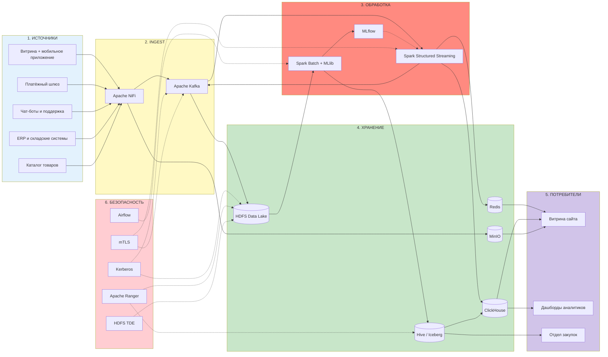

## «Проектирование архитектуры BigData-системы»
### Вариант 1. Крупный онлайн-ритейлер

---

## Постановка задачи

Онлайн-ритейлер с многомиллионной аудиторией. Данные — основной актив: от скорости анализа поведения пользователей зависит конверсия, от точности прогноза спроса — издержки на складскую логистику. Бизнес-задачи:

1.  **Анализ поведения пользователей в реальном времени.** Пока пользователь на сайте, система должна успеть обновить рекомендации и выявить подозрительную активность (фрод) до завершения заказа.
2.  **Прогнозирование спроса.** На основе всей истории продаж строить ML-модели, предсказывающие спрос на каждый товар в разрезе склада и дня — чтобы автоматически формировать заказы поставщикам.
3.  **Регуляторные требования.** 152-ФЗ по персональным данным покупателей, PCI DSS по приёму карт, доступность 99.99% (бизнес теряет деньги за каждую минуту простоя).

## Пошаговый алгоритм выполнения

### Шаг 1. Анализ требований

| Параметр | Значение | Архитектурное следствие |
|---|---|---|
| **Объём данных** | **500 ТБ/год**, рост **50%** ежегодно | HDFS на собственном оборудовании в РФ. Через 5 лет потребуется более 11 ПБ дисков. Облака невыгодны. |
| **Скорость поступления** | **до 5 000 событий/с** | Kafka с репликацией 3 и партиционированием. Пики (Чёрная пятница) не должны ронять систему. |
| **Типы данных** | 60% структурированные, 30% полуструктурированные, 10% неструктурированные | Полиглот-хранилище: HDFS для логов, ClickHouse для аналитики, MinIO для картинок товаров. |
| **Требования к обработке** | Анализ поведения в реальном времени, прогнозирование спроса | Два контура: real-time (потоковая обработка) и batch (обучение моделей на истории). |
| **Доступность** | **99.99%** (простой ≤ 52 минут/год) | Гео-резервирование между двумя ЦОДами в РФ, горячее резервирование критичных сервисов. |
| **Время отклика** | **< 5 секунд** | Redis для кэша рекомендаций, ClickHouse для аналитических запросов. Потоковая обработка должна укладываться в 1-2 секунды. |
| **Безопасность** | Шифрование, соответствие 152-ФЗ и PCI DSS | Токенизация карт на входе, маскирование ПДн, шифрование на дисках и в каналах. |

**Расчёт нагрузки:**

```
Поток:
5 000 событий/с × 3 КБ = 15 МБ/с
= 1,3 ТБ/сутки = ~474 ТБ/год

Каталог товаров с изображениями = ~30 ТБ/год
ИТОГО: ~504 ТБ/год — сходится с условием

Репликация HDFS (фактор 3): 500 × 3 = 1,5 ПБ дисков в первый год
Через 5 лет (рост 50% в год): 500 × 1.5^5 ≈ 3 800 ТБ/год → 11,4 ПБ дисков
```


### Шаг 2. Источники данных

| Источник | Тип загрузки | Поток | Формат |
|---|---|---|---|
| Витрина сайта и мобильное приложение | Потоковая | ~4 000 событий/с | JSON / Avro |
| Платёжный шлюз (оформление заказов) | Потоковая | ~1 000 транзакций/с | JSON |
| Чат-боты и обращения в поддержку | Потоковая | ~200 событий/с | Текст / JSON |
| ERP и WMS (склады, поставки) | Пакетная, каждые 15 минут | — | CSV / Avro |
| Система управления каталогом (PIM) | Пакетная, раз в сутки | — | JSON + JPEG/PNG |

### Шаг 3. Компоненты архитектуры и обоснование

#### 3.1. HDFS — основное распределённое хранилище

- HDFS хранит сырые логи, историю заказов, выгрузки из ERP. Данные лежат в открытых форматах (Parquet, Avro) и доступны любым инструментам.
- **Почему не S3:** при 500 ТБ/год и росте 50% облачное хранение становится экономически нецелесообразным. Свой HDFS-кластер дешевле в 3-5 раз на горизонте 5 лет.
- **Локализация ПДн:** HDFS разворачивается в дата-центре на территории РФ. Никакие персональные данные не уходят за пределы страны — требование 152-ФЗ закрыто.
- **Data locality:** Spark при обработке данных получает задачи на те же узлы, где лежат блоки HDFS. Сетевой ввод-вывод минимизирован, скорость обработки максимальна.
- **Масштабирование:** добавлением DataNode. С 10 узлов в первый год до 100+ через 5 лет.

#### 3.2. MinIO — объектное хранилище для неструктурированных данных

- 10% неструктурированных данных в 500 ТБ — это десятки миллионов файлов: фотографии товаров, сканы договоров с поставщиками, логотипы брендов.
- **Почему не HDFS для картинок:** NameNode HDFS хранит метаданные всех файлов в оперативной памяти. Миллионы мелких файлов (1-5 МБ) вызывают «small files problem» — память заканчивается, производительность падает.
- MinIO спроектирован для миллиардов объектов. Метаданные хранятся вместе с данными, не нагружая выделенный сервер.
- S3-совместимый API: витрина генерирует прямые ссылки на изображения, которые через CDN мгновенно доставляются пользователю.

#### 3.3. Apache Kafka — шина событий

- Принимает поток 5 000 событий/с, буферизует на диске, раздаёт потребителям.
- **Партиционирование:** топики `pageviews`, `orders`, `chat_messages` разбиты на десятки партиций. Это позволяет наращивать пропускную способность простым добавлением брокеров.
- **Надёжность:** replication factor = 3, `min.insync.replicas = 2`, `acks = all`. Сообщение считается записанным только после подтверждения минимум двух реплик. Потеря данных исключена.
- **Ретеншен:** сообщения хранятся 7 дней. Если batch-обработка упала, данные не потеряны — их можно перечитать.

#### 3.4. Apache Spark Structured Streaming — потоковая обработка

- **Почему Spark, а не Flink:** SLA ритейлера — «< 5 секунд». Микро-батчи Spark по 1-2 секунды укладываются с тройным запасом. Flink с его субсекундной задержкой избыточен. Команда уже знает PySpark, переход на Flink — это новый стек, найм, обучение, риски.
- **Что делает:** читает сырой поток из Kafka, обогащает события данными из каталога (категория товара, цена, маржинальность), обновляет профиль пользователя в Redis (текущие интересы, аффинити-категории), выявляет простые фрод-паттерны (частые заказы с нового аккаунта) и передаёт очищенный поток в ClickHouse.
- **Унификация:** тот же код на PySpark работает и в batch-режиме. Обучение моделей на исторических данных и применение на потоке — один фреймворк.

#### 3.5. ClickHouse — аналитическая СУБД для оперативных дашбордов

- Поток очищенных событий из Spark Structured Streaming заливается в ClickHouse.
- **Скорость:** колоночная архитектура и векторные вычисления дают субсекундный ответ на запросы к миллиардам строк.
- **Кейсы:** «воронка продаж за последний час», «топ-100 товаров по просмотрам сейчас», «конверсия в разрезе источников трафика».
- **Отличие от Hive:** Hive — для batch-отчётов (ночная сборка, финансовые формы). ClickHouse — для оперативных вопросов «что происходит прямо сейчас».

#### 3.6. Apache Spark (batch) — пакетная обработка и машинное обучение

- Ночью Spark забирает все данные из HDFS (двухлетняя история продаж) и обучает модели прогнозирования спроса.
- **Spark MLlib:** градиентный бустинг, случайный лес. Модель предсказывает спрос на SKU/склад/день, учитывая сезонность, промо-акции, цены конкурентов.
- **MLflow:** трекит эксперименты (гиперпараметры, метрики MAPE/WAPE), версионирует модели. Лучшая модель регистрируется и утром подхватывается в продуктив.

#### 3.7. Hive + Apache Iceberg — SQL-витрины поверх HDFS

- Hive даёт SQL-интерфейс к данным в HDFS. Аналитики и финансисты пишут привычные SELECT, не думая о том, что данные лежат в Parquet на распределённой файловой системе.
- Iceberg добавляет ACID-транзакции и снапшоты. Когда финансисты строят отчёт на начало дня, Iceberg фиксирует состояние таблицы — новые транзакции, пришедшие в процессе построения отчёта, в него не попадают. Отчёт непротиворечив.

#### 3.8. Redis — кэш в оперативной памяти

- Хранит предсчитанные рекомендации для каждого пользователя, остатки популярных товаров, ETA доставки.
- **Скорость:** менее 1 миллисекунды на запрос. Витрина делает 10-20 запросов в Redis при формировании страницы и всё равно укладывается в бюджет 5 секунд.
- **Ключи:** `user:{id}:recommendations`, `product:{id}:stock`, `order:{id}:eta`.

#### 3.9. Apache Airflow — оркестрация

- Управляет всеми фоновыми задачами как единым графом зависимостей:
    - 02:00 — выгрузка из ERP в HDFS
    - 03:00 — пересборка витрин в Hive
    - 04:00 — обучение ML-моделей в Spark
    - 05:00 — регистрация лучшей модели в MLflow
    - 06:00 — загрузка обновлённого каталога в MinIO

#### 3.10. Безопасность

| Требование | Реализация |
|---|---|
| **Локализация ПДн (152-ФЗ)** | Все серверы в ЦОДах на территории РФ. Данные не покидают страну. |
| **Аутентификация** | Kerberos. Каждый сервис и пользователь проходят проверку перед доступом к данным. |
| **Разграничение доступа** | Apache Ranger. RBAC-политики на таблицы и колонки. Номера карт маскируются: аналитик видит `****`. |
| **Шифрование в каналах** | mTLS между всеми компонентами (Kafka, Spark, HDFS, ClickHouse). |
| **Шифрование на дисках** | HDFS TDE. Данные зашифрованы, ключ в отдельном KMS. |
| **Защита платёжных данных (PCI DSS)** | Токенизация номера карты в NiFi на входе в систему. Реальный PAN не попадает в Data Lake. |
| **Аудит доступа** | Apache Ranger логирует каждый факт обращения к ПДн и платёжным данным. |
| **Доступность 99.99%** | Два ЦОДа, NameNode HA, Kafka MirrorMaker для репликации между ЦОДами. |

---

## Схема архитектуры


