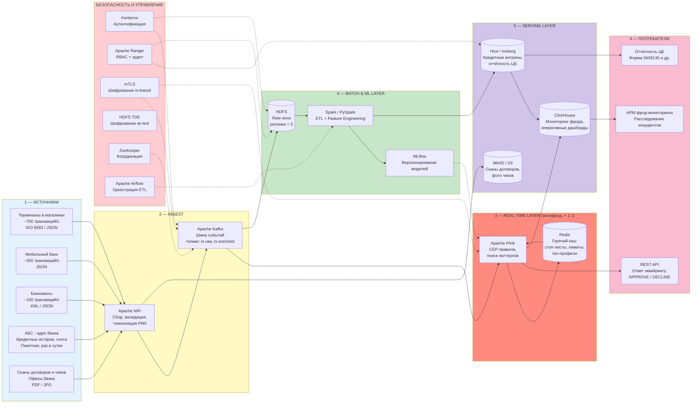

## «Проектирование архитектуры BigData-системы»
### Вариант 2. Финансовая компания

---

## Постановка задачи

Крупная финансовая организация (банк или процессинговый центр) обрабатывает экстремально высокий поток транзакций в реальном времени, а также накапливает исторические данные для оценки рисков. Ключевые бизнес-задачи:
1.  **Выявление мошенничества в реальном времени (Real-time Fraud Detection)** — блокировка подозрительной транзакции до её завершения (в течение < 1 секунды).
2.  **Оценка кредитных рисков (Credit Scoring)** — построение и применение ML-моделей на исторических данных.
3.  **Жесткое регулирование** — соответствие 152-ФЗ и требованиям ЦБ РФ (хранение данных на территории РФ, аудит, защита персональных и финансовых данных).

## Пошаговый алгоритм выполнения

### Шаг 1. Анализ требований

| Параметр | Значение | Архитектурное следствие |
|---|---|---|
| **Объём данных** | **100 ТБ/год**, рост **30%** ежегодно (≈ 371 ТБ через 5 лет) | Требуется массивно-масштабируемое хранилище (HDFS) с учетом геометрического роста |
| **Скорость поступления** | **до 1 000 транзакций/с** | Необходима высокопроизводительная стриминговая шина (Kafka) и потоковый обработчик  (Flink / Spark Streaming) |
| **Типы данных** | 80% структурированные / 15% полу- / 5% неструктурированные | Полиглот-хранилище: быстрый доступ к транзакционным витринам, объектное хранилище для сканов и логов |
| **Обработка** | Реал-тайм маршруты + Оценка рисков | **Kappa-архитектура** (предпочтительно) или Lambda с жестким SLA. Стриминг обязателен. |
| **Доступность** | **99.999%** (~5.26 мин простоя в год) | Гео-резервирование, Multi-AZ кластер, Active-Active или Hot-Standby ЦОД, полное резервирование NameNode и брокеров Kafka |
| **Время отклика** | **< 1 секунды** | In-memory вычисления, K-V хранилище (Redis/Aerospike), процессор правил (Drools) или быстрый ML-инференс |
| **Безопасность** | Сквозное шифрование + **152-ФЗ** + **ЦБ РФ** | Полный аудит (Apache Ranger), шифрование at-rest (HDFS TDE), in-transit (TLS/mTLS), маскирование данных, строгие ролевые модели |

**Расчёт нагрузки**:

```
Поток в реальном времени:
1 000 tx/с × средний размер 4 КБ (JSON с данными карты, MCC, суммой) 
= 4 МБ/с = 345 ГБ/сутки сырых событий
= ~126 ТБ/год только поток (с учетом пиков)

Batch-выгрузки (АБС, архивы):
= ~30 ТБ/год

ИТОГО Сырой объем:
≈ 156 ТБ/год, но с учетом компрессии (snappy/gzip) в Kafka и HDFS — 
эффективно 90-100 ТБ/год ✓ (сходится с условием)

С учетом реплики HDFS = 3:
100 × 3 = 300 ТБ полезной ёмкости дисков в год

Прогноз через 5 лет (рост 30%):
100 × (1.3^5) ≈ 371 ТБ/год → более 1 ПБ дискового пространства с репликацией.
Необходимо масштабирование до 25+ узлов хранения.
```

### Шаг 2. Определение источников данных

| Источник данных | Тип загрузки | Интенсивность | Формат данных | Доля в общем объёме |
|---|---|---|---|---|
| **Терминалы в магазинах** | Потоковая | ~700 транзакций/с | ISO 8583 / JSON | **Структурированные** |
| **Мобильный банк** | Потоковая  | ~200 транзакций/с | JSON | **Полуструктурированные** |
| **Банкоматы** | Потоковая (real-time) | ~100 транзакций/с | XML / JSON | **Структурированные** |
| **Автоматизированная Банковская Система - ядро банка** (Кредитные истории, счета) | Пакетная, раз в сутки | — | CSV / XML | **Структурированные** |
| **Сканы договоров и чеков** (офисы банка) | Ручная загрузка по событию | — | PDF / JPG | **Неструктурированные** |

### Шаг 3. Выбор компонентов архитектуры

#### 3.1. Распределённое хранилище — HDFS (основное) + MinIO/S3 (объектное)

**Почему HDFS:**
- Это распределённая файловая система, работающая поверх множества серверов. Данные разбиваются на блоки и хранятся с тройной копией на разных узлах. Выход из строя одного сервера не приводит к потере данных.
- Кластер разворачивается на собственном оборудовании в дата-центре на территории РФ, что закрывает требование 152-ФЗ о локализации персональных данных без привлечения иностранных облачных провайдеров.
- Высокая скорость чтения данных для задач пакетной обработки достигается за счёт того, что вычисления переносятся на те узлы, где данные уже лежат.
- Поддерживается шифрование хранящихся данных, что требуется нормативами ЦБ РФ для защиты финансовой информации.

**Почему дополнительно MinIO:**
- Неструктурированные данные (сканы договоров PDF, фото чеков JPG) представляют собой множество мелких файлов. Для такого типа нагрузки HDFS не оптимизирован и начинает расходовать слишком много оперативной памяти на служебные структуры. Объектное хранилище MinIO решает эту проблему.
- Сканы договоров — это юридически значимые документы. MinIO поддерживает режим WORM (однократная запись, многократное чтение), который запрещает изменение или удаление файла после загрузки. Это требование регулятора к хранению первичной финансовой документации.
- Объектное хранилище оптимизировано под доступ к конкретному файлу по ссылке, что удобно для операционной работы (сотрудник открывает скан договора конкретного клиента), в отличие от HDFS, заточенного под потоковую обработку больших массивов.

---

#### 3.2. Шина данных — Apache Kafka + Apache NiFi

- **Kafka** — это распределённый журнал сообщений. Он принимает поток из 1 000 транзакций в секунду, сохраняет их на диск в виде упорядоченной очереди и раздаёт потребителям. Сообщения не удаляются сразу, а хранятся заданное время, что даёт возможность перечитать историю операций для расследования инцидентов. Отказоустойчивость достигается хранением трёх копий каждого сообщения на разных серверах.
- **NiFi** — это инструмент управления потоками данных. Он забирает информацию из разнородных источников (платёжные терминалы, мобильный банк, банкоматы, главная банковская система) и передаёт её в Kafka. Ключевая функция — замена реальных номеров банковских карт на обезличенные токены непосредственно на входе в систему, до того как данные попадут в какое-либо хранилище.

---

#### 3.3. Потоковая обработка — Apache Flink

- **Flink** выполняет проверку каждой транзакции на признаки мошенничества в реальном времени. В отличие от систем, работающих микропакетами, Flink обрабатывает каждое событие отдельно, не дожидаясь накопления очереди. Это снижает задержку до 200 миллисекунд, что при общем лимите в 1 секунду оставляет достаточный запас на остальные этапы проверки.
- Встроенная библиотека CEP (Complex Event Processing) поиска шаблонов позволяет описывать сложные цепочки подозрительных действий. Пример правила: «Если по одной карте зафиксированы покупки в трёх разных городах в течение 60 секунд, транзакция блокируется». Flink отслеживает такие последовательности автоматически.
- При сбое сервера Flink восстанавливает своё состояние из контрольной точки, сохранённой в HDFS, и продолжает обработку с прерванного места без потери событий.

---

#### 3.4. Пакетная обработка и машинное обучение — Apache Spark + MLflow

- **Spark** решает задачи, не требующие мгновенного ответа: обучение моделей для оценки кредитоспособности заёмщиков, пересчёт витрин с отчётностью, подготовку данных для аналитиков.
- **MLflow** отслеживает версии обученных моделей и результаты экспериментов. Итоговая модель передаётся в контур Flink, где используется в правилах антифрода для вычисления вероятности мошенничества по характеристикам текущей транзакции.

---

#### 3.5. Витрины данных — Hive/Iceberg + ClickHouse

- **Hive / Iceberg** — это слой, позволяющий аналитикам и специалистам по данным писать запросы на языке SQL к информации, лежащей в HDFS. Iceberg добавляет возможность фиксировать состояние таблиц на определённый момент времени. Это важно при подготовке отчётности для ЦБ: отчёт формируется по срезу данных на начало дня, даже если в систему продолжают поступать новые транзакции.
- **ClickHouse** — аналитическая база данных, оптимизированная под скорость ответа. Используется для построения оперативных дашбордов: график срабатываний антифрод-правил, карта подозрительной активности, статистика отклонённых операций. Ответ на запрос занимает доли секунды.

---

#### 3.6. Кэш в оперативной памяти — Redis

- **Redis** хранит в оперативной памяти данные, к которым контур антифрода обращается на каждой проверке: список украденных карт, текущие лимиты по счетам, типичные регионы использования карты клиентом. Запрос к Redis занимает менее 1 миллисекунды, что критически важно для соблюдения общего лимита времени на проверку.

---

#### 3.7. Оркестрация — Apache Airflow

- **Airflow** управляет расписанием выполнения всех фоновых задач: ночная загрузка выгрузок из главной банковской системы, переобучение моделей кредитного скоринга, пересчёт витрин, архивирование журналов доступа. Каждая задача оформляется как звено в цепочке, где запуск следующего звена происходит только после успешного завершения предыдущего.

---

#### 3.8. Безопасность (под 152-ФЗ и требования ЦБ РФ)

| Компонент | Что делает |
|---|---|
| **Kerberos** | Проверяет подлинность каждого сервиса и пользователя при подключении к кластеру. Без успешной проверки доступ к данным невозможен |
| **Apache Ranger** | Определяет, кому и к каким данным разрешён доступ. На колонки таблиц можно навесить метки, например «номер карты», и настроить правило: аналитик видит только заменённый токен, а не реальный номер |
| **Шифрование каналов (TLS/mTLS)** | Все данные между серверами передаются в зашифрованном виде. Дополнительно каждый сервер предъявляет цифровой сертификат, подтверждающий, что это действительно он, а не подставной узел |
| **Шифрование дисков (HDFS TDE)** | Данные на жёстких дисках хранятся в зашифрованном виде. Ключ расшифровки хранится отдельно. Украв физический диск, злоумышленник получит только нечитаемый набор символов |
| **Токенизация в NiFi** | Реальный номер карты заменяется на вымышленный идентификатор сразу при входе в систему. Даже при полной утечке данных из аналитического контура номера карт не будут скомпрометированы |
| **Аудит доступа** | Каждый факт обращения к конфиденциальным данным записывается в журнал. Это требование закона: в случае инцидента можно установить, кто и когда смотрел информацию |
| **Размещение в РФ** | Все серверы основного и резервного центров обработки находятся на территории России. Журналы аудита хранятся не менее 5 лет |

## Создание схемы решения (Mermaid)


